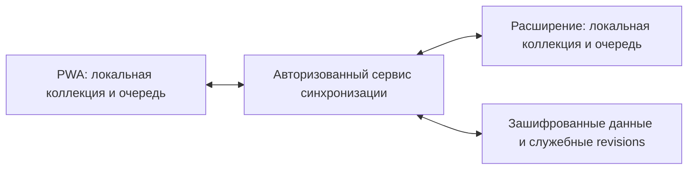

# ТЗ: мобильный Tab Atlas и синхронизация коллекций

Дата: 6 октября 2026 года.
Статус: пользователь одобрил направление PWA и поручил включить обсуждённые
требования в ТЗ. Документ описывает будущую разработку; функциональность не
реализована. Конкретный провайдер, способы входа и технический протокол ниже
отмечены как предложения, а не уже выбранные или подключённые сервисы.

## 1. Цель и границы

Дать доступ к папкам и сохранённым ссылкам Atlas с Android и iPhone, с локальной
работой без интернета и добровольной синхронизацией с настольным расширением.
Основной сценарий: сохранить статью с телефона в папку и затем увидеть её на ПК,
даже если компьютер был выключен во время сохранения.

Первая платформа — устанавливаемое веб-приложение (PWA), открываемое по HTTPS.
Пользователь не должен менять браузер или устанавливать мобильное расширение.
Приложение можно открыть как сайт; установка добавляет иконку на главный экран
и отдельное окно приложения там, где платформа поддерживает этот режим.

Настольное расширение продолжает работать локально без аккаунта. Синхронизация
включается только явно; существующие коллекции не выгружаются автоматически.
Не обещать PWA доступ к списку открытых вкладок мобильного Chrome, управление
ими, замену новой вкладки или синхронизацию browser windows/tab groups.

## 2. Мобильный интерфейс

- Переиспользовать интерфейс и терминологию Atlas: Saved for later, папки,
  ссылки, поиск, архив, Time machine. UI — английский, как в текущем продукте.
- Первым экраном показывать сохранённую коллекцию. Поиск сверху, компактные
  списки/папки, второстепенные действия в меню. Не показывать пустую секцию
  Open tabs, недоступные browser actions или постоянную панель синхронизации.
- Все 16 тем сохраняют свои материалы, семантические цвета, радиусы и тени:
  Glass — прозрачные поверхности, Soft — тактильные, solid Apple — непрозрачные.
  Использовать проектные better-* навыки при реализации и ревью интерфейса.
- Создание/переименование папок, цвет, lock, перенос и порядок ссылок/папок,
  архивирование, возврат из архива, удаление и поиск доступны с телефона.
- Перемещение доступно через действие Move, без обязательного drag. Touch drag
  может дополнять это действие после проверки жестов, прокрутки и отмены.
- Открытие ссылки — явное отдельное действие. Учитывать режим standalone,
  переходы во внешний браузер и безопасную обработку URL; сохранение/просмотр
  коллекции не открывают браузерные вкладки сами по себе.
- Сохранение подтверждается общей зелёной плашкой снизу по центру, с таймером,
  Undo и звуком при включённом Sound. На touch Undo должен быть явно достижим
  без hover; mouse hover/keyboard focus сохраняют существующее поведение.
- Настройки Sound, Motion, тема и вид — отдельные для каждого устройства.
  Уважать reduced motion; проигрывание звука учитывать в границах mobile
  autoplay/user activation, отсутствие разрешённого звука не считать ошибкой save.
- Поддержать 320 px, короткие landscape-окна, safe areas и экранную клавиатуру.
  Важные действия не перекрывают контент, названия переносятся, targets доступны
  pointer/touch/keyboard, смысл состояний доступен помимо цвета.

## 3. Установка и быстрое сохранение

### Android

Сценарий: открыть страницу в Chrome → Share → Tab Atlas → выбрать папку или
Saved for later → подтвердить. Показать заголовок/адрес перед сохранением,
сохранить страницу открытой. Использовать Web Share Target у установленной PWA.

Запрос share не должен изменять коллекцию до подтверждения. Не использовать
GET-запрос как команду записи. Обрабатывать URL, title и text разных источников,
повторную передачу, отсутствие title, некорректные/неподдерживаемые URL.
Запись и очередь синхронизации сохраняются надёжно до показа успеха.
Офлайн-сохранение возможно после установки/загрузки необходимых файлов приложения.

### iPhone / iPad

PWA устанавливается на главный экран через доступный платформе сценарий.
В первом выпуске обязательна ручная вставка ссылки. Дополнительно спроектировать
команду Shortcuts, принимающую ссылку из Share Sheet и открывающую форму Atlas;
она не сохраняет ссылку без явного подтверждения.

Не обещать, что Web Share Target Android обеспечит аналогичную регистрацию
PWA в Share Sheet iOS. Проверять текущую поддержку на целевых версиях ОС.
Полноценную системную иконку-получатель Atlas отнести к следующему этапу:
нативная iOS-оболочка с Share Extension и переиспользованием общего ядра.
Передача данных между Safari, standalone PWA, Shortcuts и оболочкой требует
отдельной приёмки; не предполагать общую локальную базу всех этих контекстов.

### Платформенные альтернативы

Отдельные нативные Android/iOS приложения и перенос расширения в Firefox Android
или Safari iOS — возможные последующие направления, не зависимости первого PWA.
Их совместимость/API/distribution оцениваются отдельно. В частности, наличие
расширений Firefox Android не означает поддержку замены новой вкладки.

## 4. Подключение устройств

Синхронизация доступна из настроек, выключена по умолчанию. Предлагаемый UX:

1. Включить Sync в расширении и войти в аккаунт.
2. Открыть/установить PWA на телефоне и войти в тот же аккаунт.
3. Безопасно привязать устройство и предоставить ему ключ коллекции.
4. Показать предварительный результат первого объединения и подтвердить.
5. Дальше отправлять/принимать изменения автоматически при доступности сети.

Способы входа-кандидаты: Google OAuth или email OTP. Окончательный выбор сделать
при проектировании auth, с проверкой extension redirect, мобильной установки,
почтовой доставки, ограничений провайдера и восстановления аккаунта.

Аккаунт и ключ расшифровки — разные сущности. Предложение для привязки:
одноразовый QR/код, подтверждение на доверенном устройстве и защищённая передача
ключа новому устройству. QR не должен содержать постоянный bearer credential или
публиковать незашифрованный master key. Подключённые устройства видны в настройках;
пользователь может отозвать устройство. Потерявшее доступ устройство не может
получать новые данные, но удалённо стереть ранее скачанные копии гарантировать нельзя.

При первой синхронизации показывать объём и конфликты существующих локальных
и облачных коллекций. Не заменять локальный Atlas автоматически, не сливать
разные папки только по имени, не удалять записи только из-за отсутствия в одной
копии. Существующие id сохранять; возможные совпадения показывать при review.
Перед подтверждённой заменой создавать защищённое локальное состояние возврата.

## 5. Данные и область синхронизации

| Данные | Политика первого выпуска |
| --- | --- |
| Папки: id, имя, цвет, lock и логический порядок | Синхронизировать |
| Ссылки: id, title, URL, folderId и логический порядок | Синхронизировать |
| Архив/завершённость сохранённой ссылки | Синхронизировать как состояние той же записи |
| Тема, раскрытие папок, фильтры, поиск, scroll, Sound/Motion | Локальные настройки устройства |
| Открытые вкладки, browser windows, native tab groups | Не включать в этот протокол |
| Workspace states, Speed dial, экспортные файлы | Отдельный будущий scope; не отправлять неявно |
| Time machine и защищённые точки Undo | Локальны на каждом устройстве |
| Очередь обмена, отметки удаления, подтверждения, bootstrap | Служебные данные синхронизации, с ограниченным хранением |

Синхронизация архива не добавляет архив в обычные слепки Time machine.
Ссылки с одинаковым URL могут быть отдельными записями; глобальная URL-дедупликация
не должна уничтожать намеренные копии, папки или разные метаданные.

У каждой папки/ссылки постоянный id. У устройства и операции — отдельные id.
Передача одной операции повторно не создаёт повторную запись или повторный Undo.
Порядок моделировать так, чтобы одновременные вставки/reorder не теряли элементы.
Глобальный локальный revision текущего writer сам по себе не является протоколом
межустройственной синхронизации: потребуются causal/base revisions и правила merge.

## 6. Локальная работа и протокол обмена

Пользовательская правка сначала сохраняется локально вместе с надёжной записью
для отправки. Облачный ответ не требуется для локального успеха. При отсутствии
интернета явно обозначать, что изменение сохранено на устройстве и ожидает обмена.

Отправлять изменения, не весь layout после каждого клика. При первом подключении
или отставании за пределы сохранённого журнала загружать зашифрованный bootstrap
актуального состояния, затем дочитывать последующие изменения. Перед rebase
сохранять/объединять неподтверждённые локальные действия.

Обязательные свойства протокола:

- Durable outbox, idempotency key, acknowledgement и отслеживание полученной
  последовательности; неподтверждённые операции не удалять из очереди.
- Повторная отправка после сети/worker termination/crash; backoff с jitter,
  без циклов запросов и многократного применения операции.
- Независимый merge правок разных записей/полей; данные не заменяются целым
  последним массивом. Время на телефоне не определяет единственный победивший layout.
- Метки удаления (tombstones), чтобы старое офлайн-устройство не воскресило
  удалённые ссылки. Компактация журнала должна учитывать восстановление старых клиентов.
- Проверка schema/version, monotonic progress и стабильная обработка batch.
  Неизвестную новую схему не записывать поверх старых локальных данных.
- Чёткая граница durable commit при нескольких локальных хранилищах: не считать
  chrome.storage и IndexedDB общей атомарной транзакцией. Recovery должен
  согласовывать коллекцию, history receipt и outbox после каждого места сбоя.
- Входящие правки применять через общую границу записи коллекций, с проверкой
  generation/revision, а не обходить writer прямыми storage.set из UI.
- Не отправлять принятую удалённую операцию обратно как новое локальное изменение.

Синхронизировать при открытии, возвращении приложения в foreground, подходящих
сетевых/background событиях и локальных правках. Push/realtime — ускорение,
а не единственный способ получить данные; missed messages дочитываются.
Chrome MV3 worker и мобильная PWA не работают постоянно. Не обещать моментальный
обмен при закрытом приложении/браузере или выключенном устройстве.

Минималистичные статусы в меню: Synced, Changes waiting to sync, Sync needs attention.
Показывать последнюю успешную синхронизацию и понятное действие восстановления.
Отсутствие сети не выдавать за потерю локально сохранённой ссылки.

## 7. Конфликты и безопасность действий

| Ситуация | Требуемое поведение |
| --- | --- |
| Папка переименована на ПК, в неё добавлена ссылка с телефона | Сохранить оба изменения по одному folder id |
| Разные ссылки добавлены одновременно | Сохранить обе, с устойчивым порядком |
| Одна папка получила разные имена/одна ссылка разные значения одного поля | Детерминированный merge или review с доступными обеими версиями; выбранное правило описать до реализации |
| Папка удалена одновременно с добавлением/перемещением ссылки в неё | Не потерять ссылку; выделить конфликт и предложить явное решение/восстановление папки |
| Ссылка удалена одновременно с правкой/реактивацией | Не воскресить и не уничтожить правку молча; сохранить варианты до разрешения |
| Одинаковое имя у разных folder id | Не объединять автоматически только по имени |
| Новые правки затрагивают locked folder | Сохранить семантику lock; конфликт не обходится входящим sync |
| Старое офлайн-устройство подключается после cleanup журнала | Безопасный bootstrap/rebase с сохранением его неотправленных изменений |

Конфликт показывать там, где можно понять затронутую папку/ссылку; preview
называет сохранённые и заменяемые данные. Идентичная повторная доставка не является
новым конфликтом. Перед опасной заменой нужен локальный защищённый возврат.

Выход из аккаунта, отключение Sync, удаление данных на устройстве, Clear history
и удаление облачной коллекции — разные действия. Не распространять локальную
очистку кеша/history или выход как удаление всех данных на остальных устройствах.
Удаление облачной коллекции/аккаунта требует отдельного подтверждения и описания
последствий; старое устройство не должно повторно залить удалённую коллекцию.

## 8. Time machine и Undo

Основная семантика — [ТЗ Time machine](time-machine-spec.md): слепки активных
папок/ссылок, автоматическая запись, архив исключён, восстановление с подтверждением
и защищённым возвратом. На телефоне использовать ту же продуктовую модель.

История локальна и может различаться на устройствах. Входящие подтверждённые
изменения коллекции также учитываются локальной записью активной проекции;
повторная доставка не создаёт дубли слепков. Bootstrap/merge не должен создавать
вымышленную помиллисекундную историю периода, когда устройство было выключено.

Текущий desktop budget — 200 MiB, trim target — 160 MiB, warning с 80%, critical
с 95%. Не выгружать эти 200 MiB на пользователя в облачную синхронизацию.
На мобильном устройстве проверять доступную quota/ошибки; логический лимит не
гарантирует столько места. При необходимости спроектировать меньший эффективный
бюджет с правдивыми warning/GC, сохранив latest/protected Undo. Изменение мобильного
бюджета явно отразить в настройках/справке и тестах, не уменьшать desktop неявно.

При включённом Sync восстановление/Undo изменяет общую коллекцию. Confirmation
сообщает, что результат попадёт на подключённые устройства. Другие устройства
не открывают исторические browser windows/tabs из-за этого события.

До commit проверить известную общую revision, включая конфликтующие удалённые
правки. При последующих изменениях Undo не заменяет их молча: review, подтверждение
и новый защищённый возврат. Предложенный review не объявляется глобально неизменным
при офлайн-восстановлении: обнаруженные при reconnect конфликты разрешаются явно.
Undo формирует новую идемпотентную операцию, а не удаляет прошлое облачного журнала.

После очистки browser/site data локальная история может исчезнуть. Синхронизированная
актуальная коллекция возвращается из облака при наличии аккаунта/ключа; Time machine
не выдавать за облачную резервную копию. Экспорт/backup и Sync — разные функции.

## 9. Шифрование, аккаунты и приватность

Сквозное шифрование коллекции — требование предлагаемого выпуска с Sync, а не
свойство, автоматически получаемое от HTTPS, Supabase Auth или RLS.

- Названия, URL, folder fields, архив и содержимое изменений шифруются на клиенте.
  Сервер хранит encrypted payload; plaintext не попадает в logs/analytics/errors.
- Документировать видимые серверу метаданные: аккаунт, opaque ids/revisions,
  устройства, размер, время/сетевые сведения. Не обещать полной анонимности.
- Auth устанавливает владельца; доступ к каждому запросу ограничен его коллекцией.
  Ключ шифрования не заменяет авторизацию, авторизация не заменяет шифрование.
- Выбрать проверенную схему authenticated encryption, key lifecycle и привязку
  payload к account/object/schema/operation. Не изобретать криптографический протокол.
  Отдельно проверить подмену, повторную доставку, key rotation и старые clients.
- Master key формируется на устройстве; recovery key/phrase выдаётся пользователю
  с проверяемым способом восстановления. Сброс account password сам по себе
  не восстанавливает потерянный encryption key. Потеря всех устройств и recovery
  должна быть честно объяснена до включения.
- Refresh/sign-in credentials, QR/device pairing и key recovery не передаются
  через общедоступные URL/логи. Серверные privileged keys не включать в bundle.
- Предусмотреть revoke, повторный вход, потерю устройства и key rotation;
  повторное подключение не раскрывает доступ к другим коллекциям.
- Обновить privacy policy, описание продукта и store disclosures перед выпуском.
  Указать opt-in передачу encrypted data и выбранных провайдеров/retention.
- Пользователь должен понимать, как отключить обмен, экспортировать коллекцию,
  удалить облачные данные и отдельно удалить локальную копию.

## 10. Хостинг и эксплуатация

Для автоматического обмена с выключенным ПК нужны публичные HTTPS-хостинг PWA
и сервис хранения/обмена. Пользователи ничего не хостят. Владелец продукта
создаёт проекты у провайдеров и контролирует billing, доступность и резервирование.
Постоянно работающий домашний ПК или самостоятельно обслуживаемый VPS не обязательны.

Предлагаемый первый стек (выбор ещё не зафиксирован):

| Компонент | Кандидат | Назначение |
| --- | --- | --- |
| Статические файлы, manifest, assets, HTTPS | Cloudflare Pages | PWA и обновления интерфейса |
| Вход, сессии и авторизация | Supabase Auth | Аккаунты и device access |
| База и серверный API/functions | Supabase | Зашифрованный bootstrap, операции, ack, revisions и квоты |

Наличие managed database/realtime не реализует merge автоматически. Протокол,
конфликты, E2EE, доступ, квоты и lifecycle — ответственность нашей реализации.
Cloudflare Workers + D1 — альтернативный кандидат, если нужен другой профиль
расходов/контроля; выбор должен учитывать стоимость auth и эксплуатации, а не
только бесплатную базу. Оболочки App Store/Google Play не нужны для первого PWA.

Для запуска нужны owner accounts, выбранный регион/retention, HTTPS-адрес,
настройки входа/почтовой доставки, секреты серверных функций и deployment pipeline.
Собственный домен желателен, но не обязателен. Не размещать секреты в репозитории.
Dev/staging отделить от production; не тестировать merge/clear на пользовательских
данных без отдельной авторизации и резервной копии.

Ориентиры тарифов на 6 октября 2026: Supabase Free — 500 MB базы на весь проект,
не на пользователя, с pause после недели неактивности; Pro — от $25/месяц.
Это не обещание нулевой стоимости или фиксированной цены будущего сервиса.
Учитывать трафик, concurrent connections, операции, bootstrap/journal, индексы,
аккаунты, email, резервные копии, домен и налоги; сверять тарифы перед запуском.
Free-план допускается для прототипа после проверки ограничений.

Определить пользовательские и общие квоты, предупреждения, rate limits,
retention/compaction, бюджет billing и восстановление после отказа провайдера.
Облачная квота не равна 200 MiB локальной истории. Переполнение/недоступность
сервиса останавливает обмен с понятным состоянием, не стирает локальные коллекции.
Восстановление облака из backup не должно молча откатывать/дублировать коллекции.

## 11. Реализация в текущем проекте

Существующая основа: `extension/lib/storage-repository.js` (collections),
`atlas-collection-commands.js` (действия), `atlas-collection-writer.js` (commit,
revision/history boundary), `atlas-history-*` (история/restore), текущие theme/UI.

Выделить переиспользуемое ядро коллекций и adapters: extension chrome.storage/
runtime, PWA IndexedDB/service worker, sync client. Не переносить chrome API calls
в обычную веб-страницу и не публиковать harness с вымышленными browser tabs как PWA.
Существующие Share/encrypted folder links не считать полноценным протоколом Sync.

Service worker PWA кеширует оболочку для офлайна. Коллекции/outbox/history хранить
отдельно от кеша файлов; обновление assets не очищает данные. Использовать versioned
миграции, совместимость protocol clients и безопасный lifecycle старой/новой версии.
storage.persist/estimate использовать по поддержке; учитывать eviction и quota,
не обещать вечное локальное хранение после установки.

Реализацию проводить по этапам:

1. Зафиксировать schema/merge, auth/key recovery, provider и threat/retention model.
2. PWA оболочка, локальные коллекции, мобильные действия, offline, import/export.
3. Opt-in аккаунты, E2EE/device binding, durable exchange, bootstrap/conflicts.
4. Подключить расширение, безопасное первое объединение и local history/Undo.
5. Android Share Target и iOS insert/Shortcuts; реальные platform checks.
6. UI/theme polish, fault/concurrency/performance, эксплуатационные процедуры,
   privacy/store docs и выпуск после конкретной reviewable приёмки.

Это этапы разработки одного направления; публикацию не объявлять законченной
после готовности только оболочки. Native iOS Share Extension — следующий scope.

## 12. Критерии приёмки

| ID | Проверка |
| --- | --- |
| MS-01 | Android/iPhone устанавливают/открывают PWA; реальные browser/standalone контексты проверены |
| MS-02 | Все 16 тем, 320 px/landscape/keyboard/safe areas; named controls, focus, reduced motion, контраст |
| MS-03 | Папки/ссылки/архив/search/order/lock работают с телефона, Move не требует drag |
| MS-04 | После первой загрузки коллекция и неподтверждённые изменения доступны offline и после перезапуска |
| MS-05 | Android Share Target принимает реальные share payloads, review/Cancel/Confirm, offline/repeat, без самовольного открытия вкладок |
| MS-06 | iOS paste/предлагаемые Shortcuts проверены реально; недоступный share target не обещается |
| MS-07 | Sync off сохраняет локальную работу без аккаунта и без выгрузки коллекции |
| MS-08 | First connect показывает merge/replace последствия и защищает текущие данные; совпадающие имена/id/URL корректны |
| MS-09 | При выключенном ПК телефон отправляет изменения; расширение дочитывает их позже |
| MS-10 | Rename + add, разные adds/reorder и archive/reactivate сходятся без потерь |
| MS-11 | Same-field, delete/edit, deleted parent/lock conflicts разрешаются без молчаливой потери вариантов |
| MS-12 | Retry, duplicates, reversed/missed delivery, clock skew, reconnect и compaction/bootstrap не дублируют и не воскрешают удалённое |
| MS-13 | Fault injection каждого commit/outbox/ack/history шага, worker termination и несколько писателей сохраняют подтверждённые действия |
| MS-14 | Restore/Undo сообщает межустройственные последствия; новые правки требуют conflict review; protected return сохраняется |
| MS-15 | Time machine active-only, local/automatic; повторный sync не дублирует слепки; 200 MiB не выгружаются в облако |
| MS-16 | Mobile quota/eviction/clear и adaptive budget дают правдивые предупреждения; assets update не очищает коллекцию |
| MS-17 | Авторизация не даёт доступ к чужим данным; сервер/bundle/logs не содержат plaintext/privileged secret/master key |
| MS-18 | Pairing, lost device, revoke/rotation, recovery и password reset имеют проверяемое поведение |
| MS-19 | Logout, Sync off, Clear history, local wipe и cloud deletion не смешиваются; старый client не заливает удалённую коллекцию |
| MS-20 | Серверная quota/outage, auth expiry, неверный/новый schema и migration failure не уничтожают локальные данные |
| MS-21 | Benchmark 100/1000/10000 links: local save/search, bootstrap, delta bytes, reconnect, memory, latency и billing нагрузка записаны |
| MS-22 | Privacy/store/UX copy отражает opt-in cloud/E2EE metadata и платформенные границы; export/backup/Sync различаются |
| MS-23 | Deployment/rollback, monitoring без содержимого ссылок, provider backup/restore, retention и billing limits документированы и проверены |

До реализации определить целевые реальные версии Android/iOS/Chrome/Safari,
бюджеты latency/memory/network и точные политики same-field/order/delete conflicts.
Каждый итоговый отчёт разделяет Node/mock, browser emulation и реальные устройства.
Отдельно проверить installed MV3, фоновые ограничения, iOS standalone storage,
Shortcuts/Share Sheet и воспроизведение звука. Не выдавать localhost fixtures
за эту приёмку. Deploy, paid plan, permissions и release требуют отдельного scope;
поручение написать ТЗ не является поручением их выполнять.

## 13. Источники и оставшиеся проектные решения

[Локальные навыки для реализации](mobile-sync-skills.md): назначение, закреплённые
источники и ограничения их применения. Они дополняют это ТЗ.

Платформенные сведения и стоимость сверены при обсуждении 6 октября 2026:

- [PWA installation](https://web.dev/learn/pwa/installation/).
- [Web Share Target](https://developer.chrome.com/docs/capabilities/web-apis/web-share-target).
- [Shortcuts: input types](https://support.apple.com/en-gb/guide/shortcuts/apd7644168e1/ios).
- [iOS Share Extension](https://developer.apple.com/documentation/foundation/supporting-suggestions-in-your-app-s-share-extension).
- [Firefox Android API differences](https://extensionworkshop.com/documentation/develop/differences-between-desktop-and-android-extensions/).
- [MV3 worker lifecycle](https://developer.chrome.com/docs/extensions/develop/concepts/service-workers/lifecycle).
- [Browser storage quotas/eviction](https://developer.mozilla.org/en-US/docs/Web/API/Storage_API/Storage_quotas_and_eviction_criteria).
- [Supabase architecture/auth](https://supabase.com/docs/guides/getting-started/architecture),
  [pricing](https://supabase.com/pricing).
- [Cloudflare Pages limits](https://developers.cloudflare.com/pages/platform/limits/),
  [Workers](https://developers.cloudflare.com/workers/), [D1](https://developers.cloudflare.com/d1/).

Перед разработкой выбрать provider/region, auth, key recovery/pairing, merge/order/
deletion и retention, account/cloud deletion semantics, mobile history budget,
целевые устройства и эксплуатационные лимиты. Это детализация одобренного
направления, не разрешение ослаблять требования offline, opt-in, E2EE,
сохранности данных или минимализма.
